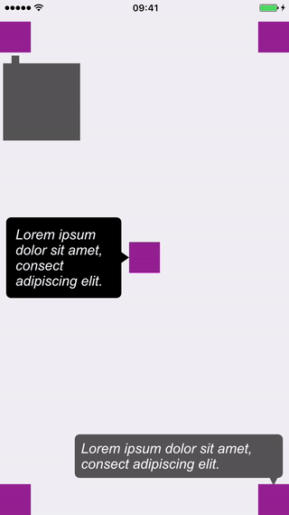

# TipView
An autolayout based ready to use tool tip library with maximum customization.

[![Swift Version][swift-image]][swift-url]
[](http://cocoapods.org/pods/LFAlertController)
[](http://makeapullrequest.com)



## Features

- [x] Ready to use tip view
- [x] Orientation support provided by autolayout engine
- [x] Global styling configuration
- [x] Override specific instance styling configuration
- [x] Supports custom views
- [x] Animation on show/dismiss
- [x] Supports custom animation
- [x] Dismiss on tap
- [x] Dismiss on tap outside within the container
- [x] Dismiss after specified duration

## Requirements

- iOS 9.0+
- Xcode 9.0

## Installation

#### Manually
1. Download and drop ```TipViewSource``` in your project.
2. Congratulations!  

## Usage example

```swift

TipView().show(message: <tip message>,
sourceView: <sourceView>,
containerView: <containerView>,
direction: .right)

// Global configurations
TipView.maxWidth = 270
TipView.color = UIColor.darkGray
TipView.font = UIFont(name: "Arial-ItalicMT", size: 18.0)
TipView.enableDismissOnTapOverTip = true
TipView.showAnimation = TipViewAnimation.showWithScale
TipView.dismissAnimation = TipViewAnimation.dismissWithScale
//TipView.enableDismissOnTapOutsideTipInContainer = true

let topLeftTip = TipView()
topLeftTip.margin = UIEdgeInsets(top: 4, left: 4, bottom: 0, right: 0)

// Most of the styling properties doesn't have any impact on custom
//topLeftTip.maxWidth = 300 // doesn't have any impact

topLeftTip.customMessageView = UIView(frame: CGRect.zero)
topLeftTip.customMessageView?.translatesAutoresizingMaskIntoConstraints = false
topLeftTip.customMessageView!.widthAnchor.constraint(equalToConstant: 100).isActive = true
topLeftTip.customMessageView!.heightAnchor.constraint(equalToConstant: 100).isActive = true
topLeftTip.customMessageView?.backgroundColor = UIColor.darkGray

topLeftTip.customAnchorView = UIView(frame: CGRect.zero)
topLeftTip.customAnchorView!.translatesAutoresizingMaskIntoConstraints = false
topLeftTip.customAnchorView!.widthAnchor.constraint(equalToConstant: 10).isActive = true
topLeftTip.customAnchorView!.heightAnchor.constraint(equalToConstant: 10).isActive = true
topLeftTip.customAnchorView!.backgroundColor = UIColor.darkGray

topLeftTip.show(message: msg,
sourceView: self.leftTopView,
containerView: self.view,
direction: .bottom)
}

```

## Contribute

We would love you for the contribution to **TipView**.

[swift-image]:https://img.shields.io/badge/swift-4.0-orange.svg
[swift-url]: https://swift.org/
[license-image]: https://img.shields.io/badge/License-MIT-blue.svg
[license-url]: LICENSE
[codebeat-image]: https://codebeat.co/badges/c19b47ea-2f9d-45df-8458-b2d952fe9dad
[codebeat-url]: https://codebeat.co/projects/github-com-vsouza-awesomeios-com
